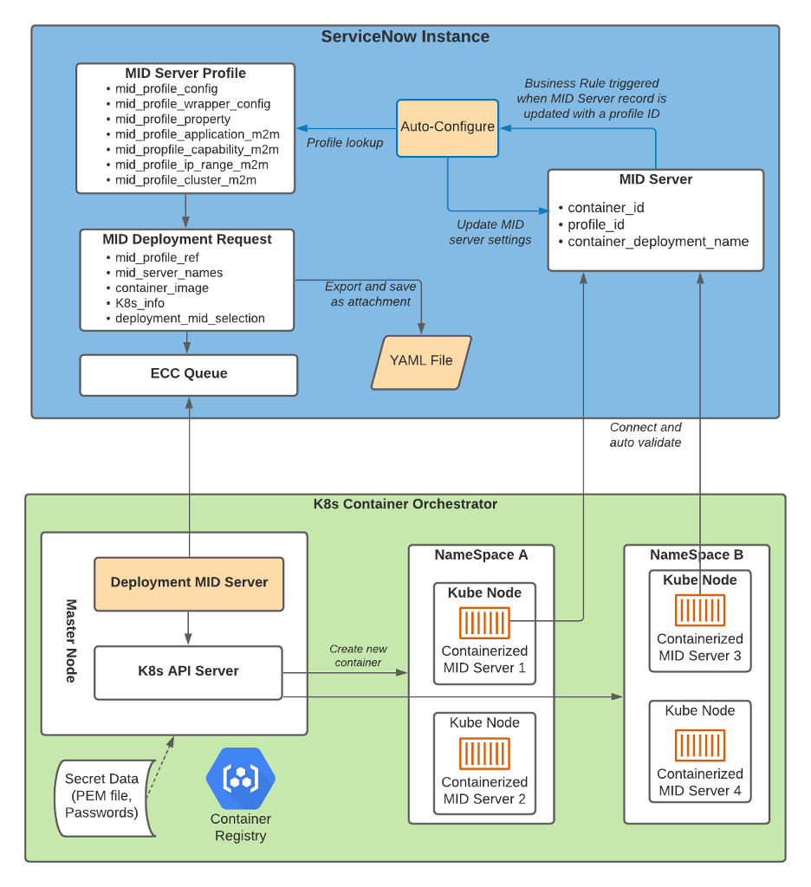

### NOTE: MY POSTINGS REFLECT MY OWN VIEWS AND DO NOT NECESSARILY REPRESENT THE VIEWS OF MY EMPLOYER

# Automatic Deployment and Configuration of Containerized MID Servers
## Why? 

As of San Diego we added the ability to automatically deploy and destroy containerized MID servers into a Kubernetes environment.  The goal is to enable customers to quickly scale up and down their discovery infrastructure to ensure that they're making the most efficient use of their cost structure for discovery components.  

## How?

In order to do this we use a MID server with cluster admin rights in order to scale up and scale down the other MID servers in the environment.  

Below is an architectural overview.  



### Overview

- Prepare instance for TLS based Mutual Auth
- Prepare TLS Certificate Chain on the Instance
- Prepare TLS Certificate Secret
- Build Container Image
- Prepare MID server profiles
- Deploy Management MID server
- Deploy multiple discovery MID servers

### Prepare instance for TLS based Mutual Auth

In order to do this you'll need to ensure your instance is prepared for TLS based mutual authentication of the MID servers.  This ensures that the MID servers you deploy come up validated and ready to go.  Additionally, it is a more secure approach as we're not passing a password variable into the MID server container at all.  

Here's the documentation on [preparing your instance](https://docs.servicenow.com/bundle/sandiego-platform-administration/page/integrate/authentication/task/set-up-mutual-auth.html).

A couple of important points to note here:  

- In order for this to work the instance will need to be on the newer load balancer solution that ServiceNow uses: ADCv2.  To test for this, run this command:  `curl -I <YOUR_INSTANCE_URL>` 
  - If the "Server" header says anything other than "snow_adc" then you're not on ADCv2.  You'll need to open a support case against your instance.  
- Once your instance is on an ADCv2 Loadbalancer, you'll need to ensure the VIP has inbound TLS enabled.  
  - To validate go to <instance_url>/adcv2/supports_tls.  
    - If it returns mixed or true, the instance supports inbound TLS.  
    - If the page is not found or is redirected, the instance does not support inbound TLS

Once that's completed, here's the documentation on how to [configure the MID server for certificate based authentication](https://docs.servicenow.com/bundle/sandiego-servicenow-platform/page/product/mid-server/task/install-mid-mutual-auth.html).  The containerized MID server handles most of that when we pass in the certificate as a secret.  However, its important to understand the details behind whats occurring.  

### Prepare TLS Certificate Chain on the Instance

There are tons of articles online about generating CA Certificates and Client certificates so I won't cover that process here.  I will cover the process of importing them into your ServiceNow instance and preparing them for use by the process.  

Here's the [documentation](https://docs.servicenow.com/bundle/rome-platform-administration/page/integrate/authentication/task/set-up-mutual-auth.html) on setting that up but I'll cover it at a high level here.  


1. Upload CA Certificate.  
    1. Go to **Certificate Based Authentication > CA Certificate Chain**.
    1. Create a New Record.  
    1. Fill out "Name" and "Short Description" fields.  Attach the .pem file to the record and submit it.  
    1. This now synchs the root certificate over to the LoadBalancer so that it will trust it for SSL authentication.  Wait for the "Publish Status" to go "Active".  This can take up to 10 minutes.  
1. If there's an Intermediate cert in the chain repeat step 1 with the Intermediate cert. 
1. Map the Client Certificate to a User
    1. Go to **Certificate Based Authentication > User to Certificate Mapping**.
    1. Create a new record.  
    1. Fill out the "Name" field with a descriptive name showing the mapping of certificate to the MID Server User.
    1. Fill out the "User" field with the username of the MID server user you'll want all your discovery MID servers to login as.  
    1. Attach the certificate to the record and submit it. 

### Prepare TLS Certificate Secret

We'll need to add the .PEM file as a Kubernetes secret so that both the Deployment MID server and the Discovery MID servers can mount it and use it to authenticate against the instance.  

1. Ensure we have both the certificate and the key in the same file: `cat client.cert client.key > mid-cert.pem`
1. Build the kubernetes secret: `kubectl create secret generic mid-cert --from-file=./mid-cert.pem`
1. NOTE THE FILE NAME.  This is an important step and you'll need it later.  <IMPORTANT_FILE_NAME>

### Build Container Image

Build your container image based on this community article I posted [here](https://community.servicenow.com/community?id=community_article&sys_id=73c1081edb5dc11007ab826305961983). 

### Create ClusterRole for Deployment MID

In order to deploy the automated MID servers this process uses a deployment MID server already in the cluster that has the appropriate permissions to automate this process.  

To do that we'll need to create a role, give it the proper permissions and deploy the MID server using that role.  

Create a file called deployment_mid_rbac.yaml:
```
apiVersion: v1
kind: ServiceAccount
metadata:
  name: k8smiddeploymentaccount
---
apiVersion: rbac.authorization.k8s.io/v1
kind: ClusterRoleBinding
metadata:
  name: k8smiddeployment
roleRef:
  apiGroup: rbac.authorization.k8s.io
  kind: ClusterRole
  name: cluster-admin
subjects:
  - kind: ServiceAccount
    name: k8smiddeploymentaccount
```

Next apply that role to the cluster: `kubectl apply -f deployment_mid_rbac.yaml`

### Publish Deployment MID server

We'll need to stand up the deployment MID server so that it uses this new role and has access to the TLS certificate so it can authenticate against the instance.  

Create a file called deploymentmid.yaml: 
```
apiVersion: apps/v1
kind: Deployment
metadata:
  name: deploymentmid
spec:
  selector:
    matchLabels:
      app: MIDServerManagement
      provider: ServiceNow
      type: DeploymentMID
  replicas: 1
  template:
    metadata:
      labels:
        app: MIDServerManagement
        provider: ServiceNow
        type: DeploymentMID
    spec:
      containers:
        - name: mutual-auth-deployment-container
          imagePullPolicy: Always
          image: <IMAGEURL:TAG>
          env:
            - name: MID_INSTANCE_URL
              value: "<INSTANCE_URL>"
            - name: MID_SERVER_NAME
              value: "certmid"
            - name: MID_MUTUAL_AUTH_PEM_FILE
              value: "/path/to/secret/<IMPORTANT_FILE_NAME>"
          volumeMounts:
            - mountPath: "/path/to/secret/"
              name: mid-cert
              readOnly: true
      serviceAccountName: "k8smiddeploymentaccount"
      volumes:
        - name: mid-cert
          secret: 
            readOnly: true
            secretName: mid-cert
```

There are a couple important things to point out in that deployment file: 

1. The MID_MUTUAL_AUTH_PEM_FILE variable needs to have the full path the PEM file as it will get mounted into the container.  So it will include the important file name that you had to remember from the secret preparation step.  e.g.: /mnt/secrets/mid-cert/client.pem
1. The serviceAccountName: attribute tells the pod the name of the service account that it should assume in order to complete it's actions within the cluster.  This needs to be the role we created earlier with cluster-admin privileges so we can deploy and delete pods as needed.  

Now go apply that file to your cluster: `kubectl apply -f deploymentmid.yaml`

At this point you should see a new MID server come up in your instance.  It will be authenticated with the certificate and won't require validation.  

You'll need to edit the "Supported Applications" to include "MID Management" and ensure the "Capabilities" for that MID include "Kubernetes"

### Prepare MID server profile

In order to deploy and configure MID servers on your behalf, the instance has to understand how you'd like them configured.  To that end we've created MID server profiles that you can use to control how they'll be configured once they're deployed.  You can even re-configure the already deployed MIDs by editing the profile and synching it to the MIDs.  

Here's the [documentation](https://docs.servicenow.com/bundle/sandiego-servicenow-platform/page/product/mid-server/concept/containerized-mid-deployment.html) to create profiles manually.  

However, I highly recommend you look at Will Hallam's [community article](https://community.servicenow.com/community?id=community_article&sys_id=0a8bb9b4db4385503321db85ca9619b4).  This is a scoped app he wrote to build a profile out of an existing MID server so that you can quickly clone out an existing MID.  

### Prepare MID server Deployment Request

Now that we have our certificates all setup, our secrets all configured, our deployment MID server up and running, and our profiles ready to go, It's time to deploy some MID servers! 

We need to create a deployment request as follows: 

1. Go to **MID Server > Profiles and Deployments > MID Deployment Requests**
1. Create a New record. 
1. Select "MID K8s Deployment Request"
1. Fill out the Name and Description so you can easily identify the requests. 
1. Select the MID Profile you'd like to use to configure thes MID servers.  
1. Ensure you have the correct URL for the Image Repository and the Image tag.  These should be available from the "Build Container Image" step.  
1. On the "Specify MID Server Names" tab select a naming scheme and a quantity of MIDs you'd like to deploy.  
1. On the "Enter Kubernetes Cluster Info" tab provide the following information:
    1. "MID Mutual Auth PEM Secrets Name" which will be the name of the secret you created in the "Prepare TLS Certificate Secret" step.  
    1. "MID Mutual Auth PEM File Path" which will be the full path of the PEM file as its mounted in the container.  This should match the "MID_MUTUAL_AUTH_PEM_FILE" value in the deploymentmid.yaml


### Deploy multiple discovery MID servers

As soon as you hit submit, the Deployment MID server will begin to execute the Operations against the cluster to deploy the requested MID servers.  

If you watch the logs for the deployment MID server you'll see something like this:  

```
04/27/22 22:00:08 (790) Worker-Standard:KubernetesOperationProbe-289a46be87878110cb267489cebb35c2 Worker starting: KubernetesOperationProbe
```

If that returns anything other than the below log then you likely have a configuration issue that'll need to be reviewed.  

```
04/28/22 04:28:03 (375) Worker-Standard:KubernetesOperationProbe-ac332ffe8703c110cb267489cebb355c Worker completed: KubernetesOperationProbe time: 0:00:41.574
```
