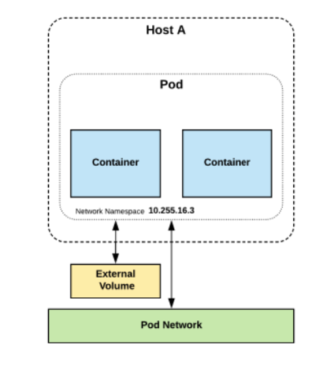
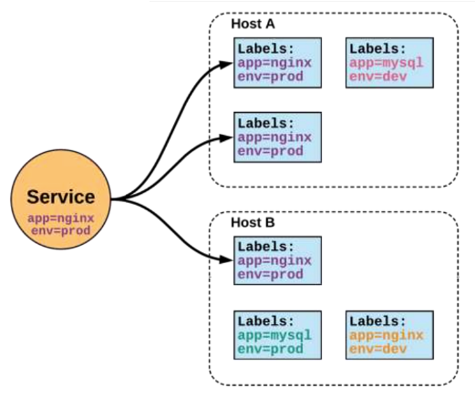
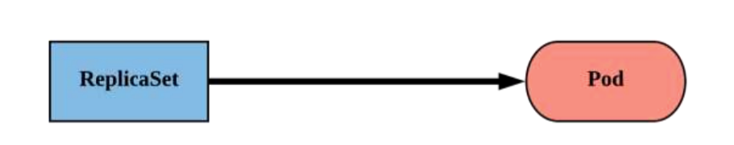
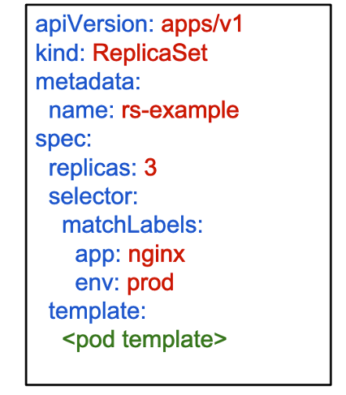
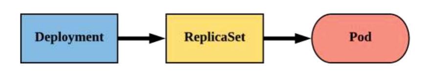
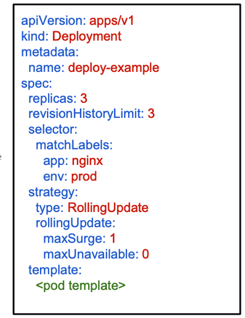
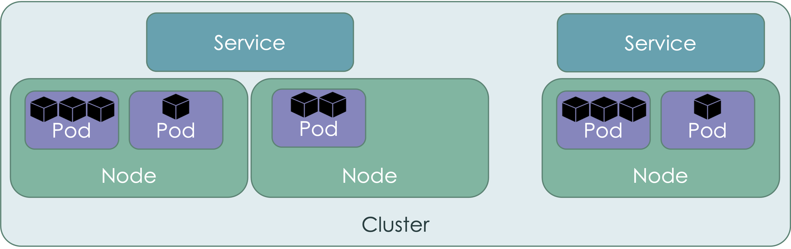

# Overview of all concepts related to K8s Discovery using ServiceNow

## OVERVIEW OF KUBERNETES

- What is Kubernetes? 
    - Frequently shortend to "K8s" because Kubernetes is a "K", 8 letters, and then an "s".
    - A Production-Grade Container Orchestration System Google-grown, based on Borg and Omega, systems that run inside of Google right now and are proven to work at Google for over 10 years. 
    - Google spawns billions of containers per week with these systems.
    - Created by three Google employees initially during the summer of 2014; grew exponentially and became the first project to get donated to the CNCF.  
    - Hit the first production-grade version v1.0.1 in July 2015. Has continually released a new minor version every three months since v1.2.0 in March 2016. 
- Decouple Infrastructure and Scaling
    - All services within Kubernetes are natively Load Balanced. 
    - Can scale up and down dynamically. 
    - Used both to enable self-healing and seamless upgrading or rollback of applications.
- Self Healing
    - Kubernetes will ALWAYS try and steer the cluster to its desired state.
        - Me: “I want 3 healthy instances of redis to always be running.” 
        - Kubernetes: “Okay, I’ll ensure there are always 3 instances up and running.”
        - Kubernetes: “Oh look, one has died. I’m going to attempt to spin up a new one.”

- Resource Types
    - Pods
        - Atomic unit or smallest “unit of work”of Kubernetes.
        - Pods are one or MORE containers that share volumes and namespace.
        - They are also ephemeral!
        
    - Services
        - Unified method of accessing the exposed workloads of Pods. 
        - Durable resource 
            - static cluster IP 
            - static namespaced DNS name
        
    - ReplicaSet
        - Primary method of managing pod replicas and their lifecycle.
        - Includes their scheduling, scaling, and deletion.
        - Their job is simple: Always ensure the desired number of pods are running.
        
        - replicas: The desired number of instances of the Pod. 
        - selector:  The label selector for the ReplicaSet will manage ALL Pod instances that it targets; whether it’s desired or not.
        
    - Deployment
        - Way of managing Pods via ReplicaSets.
        - Provide rollback functionality and update control.
        - Updates are managed through the pod-template-hash label.
        - Each iteration creates a unique label that is assigned to both the ReplicaSet and subsequent Pods.
        
        - strategy: Describes the method of updating the Pods based on the type. Valid options are Recreate or RollingUpdate.
            - Recreate: All existing Pods are killed before the new ones are created. 
            - RollingUpdate: Cycles through updating the Pods according to the parameters: maxSurge and maxUnavailable
            
    - Example Cluster Overview
    

## K8S DISCOVERY OPTIONS

- Manual Out of the Box Patterns
    - Overview: 
        - Standard patterns that have been built into the ServiceNow Platform for years.  Utilizes the MID server to make API calls to the K8s cluster endpoint.
    - Pros: 
        - OOB Discovery Patterns that have been supported years.
    - Cons: 
        - Requires Credentials to be managed for every single cluster. 
        - Requires two separate schedules for each cluster: Standard and Event.
    - Supported Platforms: 
        - Containerized MID
        - Standard MID
        - Vanilla K8s
        - AKS
        - EKS
        - GKE
- Cloud Native Operations
    - Overview: 
        - Store Application that provides significant capabilities specifically designed to assist in managing Kubernetes infrastructure at a deeper level.
    - Pros: 
        - Easily automated deployment into clusters to be managed.  
        - Includes metric ingestion for health management.  
        - Assists with traffic and tag based service mapping
        - No credentials management required.  
    - Cons: 
        - Not yet G/A.
        - Scaling can be challenging due to MID server per cluster and ACC Agents in each node.  
        - Requires deep integration with the cluster to ingest metrics and traffic data.  
    - Supported Platforms: 
        - Containerized MID
        - Vanilla K8s
        - AKS
        - EKS
        - GKE
- Automated Discovery Patterns
    - Overview:
        - Updated pattern that automatically creates credentials and discovery schedules automatically as they’re discovered via the cloud provider API.
    - Pros: 
        - Automatically schedules discovery of all clusters based on Cloud API discovery. 
        - Manages discovery schedules and credentials for each cluster discovered.   
    - Cons: 
        - Schedules launch the manual Kubernetes patterns and so are subject to those same limitations.
        - Requires that Kubernetes clusters are deployed with credentials tied into the IAM capability of the Cloud Provider.  
    - Supported Platforms: 
        - Containerized MID
        - AKS
        - EKS
        - GKE

## DISCOVERED COMPONENTS

The out of the box patterns discover a significant amount of resources within Kubernetes environments.  Too many to document here separately so I'll link to the official [ServiceNow documentation](https://docs.servicenow.com/en-US/bundle/sandiego-it-operations-management/page/product/service-mapping/concept/kubernetes-discovery.html).   

<!-- 
## CORE OOB K8S DISCOVERY CONFIGURATION

## LOCAL K8S SETUP
 
## AMAZON AWS ELASTIC KUBERNETES SERIVCE (EKS)
 
## MICROSOFT AZURE KUBERNETES SERVICE (AKS)
 
## GOOGLE KUBERNETES ENGINE (GKE)
 
## RANCHER KUBERNETES ENGINE (RKE)

-->